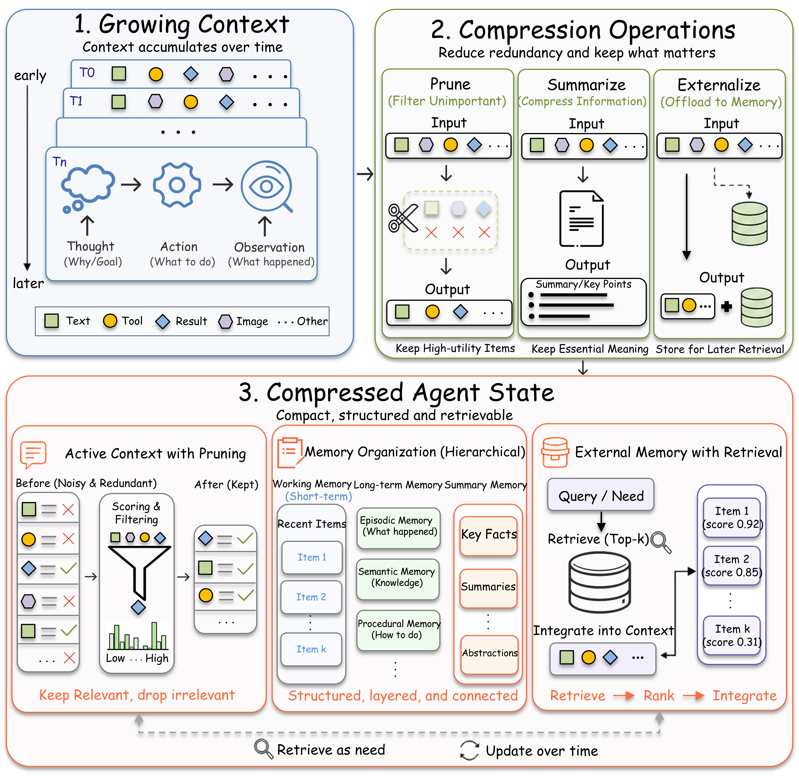
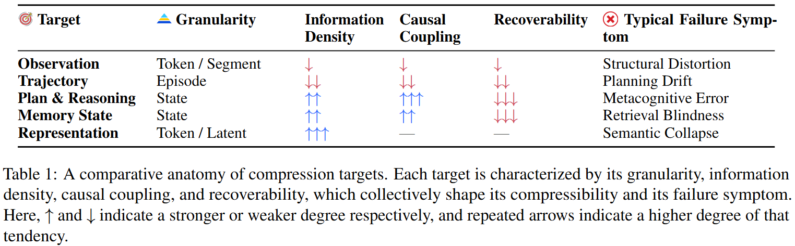
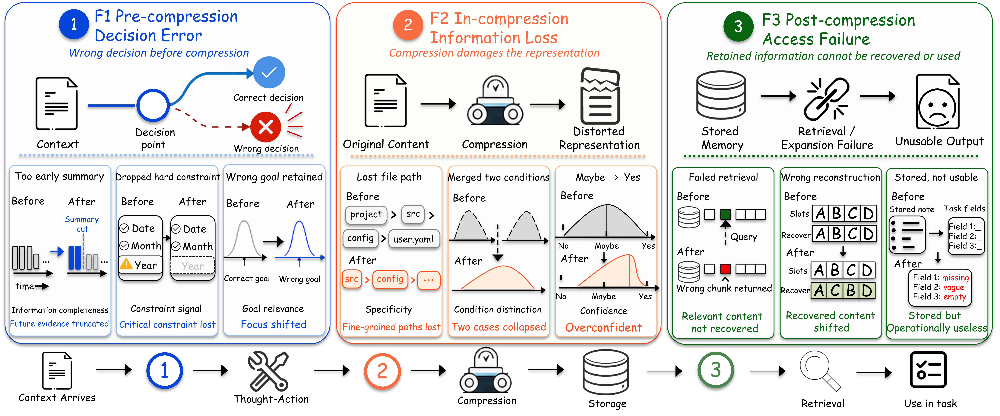
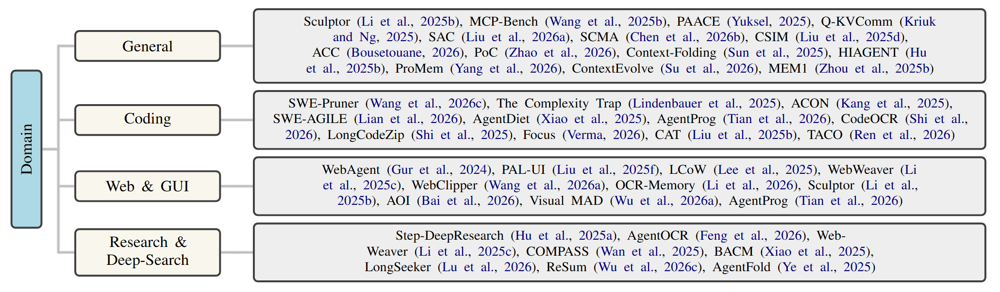
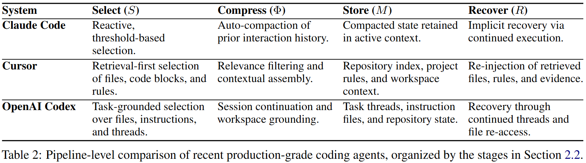

# Awesome Context Compression for LLM Agents

<div align="center">

[](https://www.preprints.org/manuscript/202605.2065)
[](https://awesome.re)
[](https://opensource.org/licenses/MIT)
[](http://makeapullrequest.com)

</div>

> A comprehensive survey and curated list of resources on **Context Compression in Long-Horizon LLM-based Agents** — covering observation compression, trajectory compression, plan & reasoning compression, memory state compression, and representation-level compression for coding agents, web/GUI agents, research agents, and multi-agent systems.

<!-- ## 📧 Contact

For questions, suggestions, or collaboration opportunities, please feel free to reach out:

**Your Name**
📧 Email: [your-email@example.com](mailto:your-email@example.com)

You can also open an issue in this repository for general discussions and suggestions. -->

---

## 📰 News

- **[2026.05]** Our survey [*Context Compression for LLM Agents: A Survey of Methods, Failure Modes, and Evaluation*](https://www.preprints.org/manuscript/202605.2065) is released!
- **[2026.04]** Repository initialized with comprehensive paper list from our survey

---

## 🎯 Introduction

<p align="center">
  
</p>

With the rapid evolution of LLM agents, long context has become a central challenge across open-ended domains such as automated software engineering, visual GUI navigation, and deep research. As agents continuously interact with dynamic environments, their operational history forms an **unbounded agentic trajectory**. This trajectory, typified by the interleaved and heterogeneous ReAct paradigm of Actions, Thoughts, and Observations (A-T-O), can quickly exhaust the LLM context window and trigger severe **context explosion**. Such explosion leads to cascading failures in which information density drops, critical constraints fade, and long-horizon planning deteriorates.

- **Dynamic growth**: Context expands with every observation, action, and tool output
- **Heterogeneous composition**: A-T-O trajectories mix code, HTML, plans, and dialogue history
- **Multi-step dependency**: Information irrelevant now may matter later
- **Error propagation**: Compression mistakes compound over long horizons

This repository organizes the literature along three axes: **what** is selected for compression, **how** it is transformed, and **who** decides when compression occurs. These axes map onto the pipeline: targets define the input to **Select** (`S`), mechanisms implement **Compress** (`Φ`) and **Store** (`M`), and control policies govern when these stages, and when necessary **Recover** (`R`), are invoked.

| Axis | Dimension | Range |
|------|-----------|-------|
| **What** | Compression targets | Observation → Trajectory → Plan and reasoning → Memory state → Representation-level |
| **How** | Compression mechanisms | Masking and truncation → Summarization and abstraction → Pruning and reduction → Externalization and retrieval → Representation compression |
| **Who/When** | Control policies and intervention timing | System-controlled → External controller → Agent-controlled → Learned |

<p align="center">
  
</p>

---

## 📚 Table of Contents

- [Awesome Context Compression for LLM Agents](#awesome-context-compression-for-llm-agents)
  - [📰 News](#-news)
  - [🎯 Introduction](#-introduction)
  - [📚 Table of Contents](#-table-of-contents)
  - [🔗 Related Surveys](#-related-surveys)
  - [🏗️ Background \& Foundations](#️-background--foundations)
  - [🎯 Compression Targets(What)](#-compression-targetswhat)
    - [Observation Compression](#observation-compression)
    - [Trajectory Compression](#trajectory-compression)
    - [Plan and Reasoning Compression](#plan-and-reasoning-compression)
    - [Memory State Compression](#memory-state-compression)
    - [Representation-Level Compression](#representation-level-compression)
  - [🔧 Compression Mechanisms(How)](#-compression-mechanismshow)
    - [Masking and Truncation](#masking-and-truncation)
    - [Summarization and Abstraction](#summarization-and-abstraction)
    - [Pruning and Reduction](#pruning-and-reduction)
    - [Externalization and Retrieval](#externalization-and-retrieval)
    - [Representation Compression](#representation-compression)
  - [🧭 Control Policies and Intervention Timing(Who/When)](#-control-policies-and-intervention-timingwhowhen)
    - [System-Controlled Policies](#system-controlled-policies)
    - [External Controller Policies](#external-controller-policies)
    - [Agent-Controlled Policies](#agent-controlled-policies)
    - [Learned Policies](#learned-policies)
  - [⚠️ Failure Modes](#️-failure-modes)
  - [🌍 Domain-Specific Analysis](#-domain-specific-analysis)
    - [Coding Agents](#coding-agents)
    - [Web \& GUI Agents](#web--gui-agents)
    - [Research \& Deep-Search Agents](#research--deep-search-agents)
    - [Multi-Agent Systems](#multi-agent-systems)
  - [📊 Evaluation \& Benchmarks](#-evaluation--benchmarks)
  - [🔮 Future Directions](#-future-directions)
  - [🤝 Contributing](#-contributing)
    - [Paper Formatting Guidelines](#paper-formatting-guidelines)
    - [Badge Colors](#badge-colors)
  - [📄 License](#-license)
  - [📑 Citation](#-citation)
  - [⭐ Star History](#-star-history)

---

## 🔗 Related Surveys

<b>Agent Surveys</b>

<ul>
<li><i><b>The Rise and Potential of Large Language Model Based Agents: A Survey</b></i>, Xi et al., <a href="https://arxiv.org/abs/2309.07864" target="_blank"></a></li>
<li><i><b>A Survey on Large Language Model Based Autonomous Agents</b></i>, Wang et al., <a href="https://doi.org/10.1007/s11704-024-40231-1" target="_blank"></a></li>
<li><i><b>A Survey of Context Engineering for Large Language Models</b></i>, Mei et al., <a href="https://arxiv.org/abs/2507.13334" target="_blank"></a></li>
</ul>

<b>Prompt & Context Compression</b>

<ul>
<li><i><b>LLMLingua: Compressing Prompts for Accelerated Inference of Large Language Models</b></i>, Jiang et al., <a href="https://aclanthology.org/2023.emnlp-main.825/" target="_blank"></a>
    <a href="https://github.com/microsoft/LLMLingua" target="_blank"></a></li>
<li><i><b>LongLLMLingua: Accelerating and Enhancing LLMs in Long Context Scenarios via Prompt Compression</b></i>, Jiang et al., <a href="https://arxiv.org/abs/2310.06839" target="_blank"></a>
    <a href="https://github.com/microsoft/LLMLingua" target="_blank"></a></li>
<li><i><b>Compressing Context to Enhance Inference Efficiency of Large Language Models</b></i>, Li et al., <a href="https://aclanthology.org/2023.emnlp-main.391/" target="_blank"></a></li>
</ul>

<b>Tool Learning & Agent Evaluation</b>

<ul>
<li><i><b>Tool Learning with Foundation Models</b></i>, Qin et al., <a href="https://doi.org/10.1145/3704435" target="_blank"></a></li>
<li><i><b>AgentBench: Evaluating LLMs as Agents</b></i>, Liu et al., <a href="https://arxiv.org/abs/2308.03688" target="_blank"></a></li>
<li><i><b>WebArena: A Realistic Web Environment for Building Autonomous Agents</b></i>, Zhou et al., <a href="https://arxiv.org/abs/2307.13854" target="_blank"></a></li>
</ul>

<b>Long Context</b>

<ul>
<li><i><b>Lost in the Middle: How Language Models Use Long Contexts</b></i>, Liu et al., <a href="https://arxiv.org/abs/2307.03172" target="_blank"></a></li>
<li><i><b>Longformer: The Long-Document Transformer</b></i>, Beltagy et al., <a href="https://arxiv.org/abs/2004.05150" target="_blank"></a></li>
<li><i><b>LLM Maybe LongLM: SelfExtend LLM Context Window Without Tuning</b></i>, Jin et al., <a href="https://arxiv.org/abs/2401.01325" target="_blank"></a>
    <a href="https://github.com/datamllab/LongLM" target="_blank"></a></li>
</ul>

---

## 🏗️ Background & Foundations

Agent context differs fundamentally from static prompts. The unified pipeline formulation is **S → C → M → R** (Sense → Compress → Memorize → Respond). Key challenges include:

- **Dynamic growth**: Context expands with every observation, action, and tool output
- **Heterogeneous composition**: A-T-O trajectories mix code, HTML, plans, and dialogue history
- **Multi-step dependency**: Information irrelevant now may matter later
- **Error propagation**: Compression mistakes compound over long horizons

<ul>
<li><i><b>ReAct: Synergizing Reasoning and Acting in Language Models</b></i>, Yao et al., <a href="https://arxiv.org/abs/2210.03629" target="_blank"></a>
    <a href="https://github.com/ysymyth/ReAct" target="_blank"></a></li>
</ul>

---

## 🎯 Compression Targets(What)

<p align="center">
  
</p>

### Observation Compression

Compressing raw environment observations (HTML pages, code files, tool outputs, screenshots) before they enter the agent context.

<ul>
<li><i><b>The Complexity Trap: Simple Observation Masking Is as Efficient as LLM Summarization for Agent Context Management</b></i>, Lindenbauer et al., <a href="https://arxiv.org/abs/2508.21433" target="_blank"></a></li>
<li><i><b>A Real-World WebAgent with Planning, Long Context Understanding, and Program Synthesis</b></i> (HTML-T5), Gur et al., <a href="https://arxiv.org/abs/2307.12856" target="_blank"></a></li>
<li><i><b>Learning to Contextualize Web Pages for Enhanced Decision Making by LLM Agents</b></i> (LCoW), Lee et al., <a href="https://arxiv.org/abs/2503.10689" target="_blank"></a></li>
<li><i><b>SWE-Pruner: Self-Adaptive Context Pruning for Coding Agents</b></i>, Wang et al., <a href="https://arxiv.org/abs/2601.16746" target="_blank"></a></li>
<li><i><b>PAL-UI: Planning with Active Look-back for Vision-Based GUI Agents</b></i>, Liu et al., <a href="https://arxiv.org/abs/2510.00413" target="_blank"></a></li>
<li><i><b>MCP-Bench: Benchmarking Tool-Using LLM Agents with Complex Real-World Tasks via MCP Servers</b></i>, Wang et al., <a href="https://arxiv.org/abs/2508.20453" target="_blank"></a></li>
<li><i><b>Step-DeepResearch Technical Report</b></i>, Hu et al., <a href="https://arxiv.org/abs/2512.20491" target="_blank"></a></li>
<li><i><b>AttentionRAG: Attention-Guided Context Pruning in Retrieval-Augmented Generation</b></i>, Fang et al., <a href="https://arxiv.org/abs/2503.10720" target="_blank"></a></li>
<li><i><b>LongCodeZip: Compress Long Context for Code Language Models</b></i>, Shi et al., <a href="https://arxiv.org/abs/2510.00446" target="_blank"></a></li>
<li><i><b>A Self-Evolving Framework for Efficient Terminal Agents via Observational Context Compression</b></i> (TACO), Ren et al., <a href="https://arxiv.org/abs/2604.19572" target="_blank"></a></li>
<li><i><b>CodeOCR: On the Effectiveness of Vision Language Models in Code Understanding</b></i>, Shi et al., <a href="https://arxiv.org/abs/2602.01785" target="_blank"></a></li>
</ul>

### Trajectory Compression

Compressing the accumulated action–observation history of agent execution traces.

<ul>
<li><i><b>Improving the Efficiency of LLM Agent Systems through Trajectory Reduction</b></i> (AgentDiet), Xiao et al., <a href="https://arxiv.org/abs/2509.23586" target="_blank"></a></li>
<li><i><b>ReSum: Unlocking Long-Horizon Search Intelligence via Context Summarization</b></i>, Wu et al., <a href="https://arxiv.org/abs/2509.13313" target="_blank"></a></li>
<li><i><b>WebClipper: Efficient Evolution of Web Agents with Graph-based Trajectory Pruning</b></i>, Wang et al., <a href="https://arxiv.org/abs/2602.12852" target="_blank"></a></li>
<li><i><b>AgentFold: Long-Horizon Web Agents with Proactive Context Management</b></i>, Ye et al., <a href="https://arxiv.org/abs/2510.24699" target="_blank"></a></li>
<li><i><b>Active Context Compression: Autonomous Memory Management in LLM Agents</b></i> (Focus/ACC), Verma, <a href="https://arxiv.org/abs/2601.07190" target="_blank"></a></li>
<li><i><b>Context as a Tool: Context Management for Long-Horizon SWE-Agents</b></i> (CAT), Liu et al., <a href="https://arxiv.org/abs/2512.22087" target="_blank"></a></li>
<li><i><b>ContextEvolve: Multi-Agent Context Compression for Systems Code Optimization</b></i>, Su et al., <a href="https://arxiv.org/abs/2602.02597" target="_blank"></a></li>
<li><i><b>ContextBudget: Budget-Aware Context Management for Long-Horizon Search Agents</b></i>, Wu et al., <a href="https://arxiv.org/abs/2604.01664" target="_blank"></a></li>
<li><i><b>Improving the Efficiency of LLM Agent Systems through Trajectory Reduction</b></i> (BACM), Xiao et al., <a href="https://arxiv.org/abs/2509.23586" target="_blank"></a></li>
<li><i><b>LongSeeker: Elastic Context Orchestration for Long-Horizon Search Agents</b></i>, Lu et al., <a href="https://arxiv.org/abs/2605.05191" target="_blank"></a></li>
<li><i><b>Scaling Long-Horizon LLM Agent via Context-Folding</b></i> (Context-Folding), Sun et al., <a href="https://arxiv.org/abs/2510.11967" target="_blank"></a></li>
</ul>

### Plan and Reasoning Compression

Compressing planning traces, chain-of-thought reasoning, and intermediate deliberation.

<ul>
<li><i><b>ACON: Optimizing Context Compression for Long-horizon LLM Agents</b></i>, Kang et al., <a href="https://arxiv.org/abs/2510.00615" target="_blank"></a></li>
<li><i><b>PAACE: A Plan-Aware Automated Agent Context Engineering Framework</b></i>, Yuksel, <a href="https://arxiv.org/abs/2512.16970" target="_blank"></a></li>
<li><i><b>Self-Compression of Chain-of-Thought via Multi-Agent Reinforcement Learning</b></i> (SCMA), Chen et al., <a href="https://arxiv.org/abs/2601.21919" target="_blank"></a></li>
<li><i><b>COMPASS: Enhancing Agent Long-Horizon Reasoning with Evolving Context</b></i>, Wan et al., <a href="https://arxiv.org/abs/2510.08790" target="_blank"></a></li>
<li><i><b>Compressed Step Information Memory for End-to-End Agent Foundation Models</b></i> (CSIM), Liu et al., <a href="https://openreview.net/forum?id=vUG2hpVJWR" target="_blank"></a></li>
<li><i><b>SWE-AGILE: A Software Agent Framework for Efficiently Managing Dynamic Reasoning Context</b></i>, Lian et al., <a href="https://arxiv.org/abs/2604.11716" target="_blank"></a></li>
<li><i><b>HiAgent: Hierarchical Working Memory Management for Solving Long-Horizon Agent Tasks with Large Language Model</b></i> (HIAGENT), Hu et al., <a href="https://aclanthology.org/2025.acl-long.1575/" target="_blank"></a></li>
</ul>

### Memory State Compression

Compressing and managing long-term memory states, knowledge stores, and persistent agent state.

<ul>
<li><i><b>MEM1: Learning to Synergize Memory and Reasoning for Efficient Long-Horizon Agents</b></i>, Zhou et al., <a href="https://arxiv.org/abs/2506.15841" target="_blank"></a></li>
<li><i><b>AOI: Context-Aware Multi-Agent Operations via Dynamic Scheduling and Hierarchical Memory Compression</b></i>, Bai et al., <a href="https://arxiv.org/abs/2512.13956" target="_blank"></a></li>
<li><i><b>AI Agents Need Memory Control Over More Context</b></i>, Bousetouane, <a href="https://arxiv.org/abs/2601.11653" target="_blank"></a></li>
<li><i><b>Sculptor: Empowering LLMs with Cognitive Agency via Active Context Management</b></i>, Li et al., <a href="https://arxiv.org/abs/2508.04664" target="_blank"></a></li>
<li><i><b>A Scalable Benchmark for Repository-Oriented Long-Horizon Conversational Context Management</b></i> (LoCoEval Framework), Liu et al., <a href="https://arxiv.org/abs/2603.06358" target="_blank"></a></li>
<li><i><b>ContextWeaver: Selective and Dependency-Structured Memory Construction for LLM Agents</b></i>, Wu et al., <a href="https://arxiv.org/abs/2604.23069" target="_blank"></a></li>
<li><i><b>Beyond Static Summarization: Proactive Memory Extraction for LLM Agents</b></i> (ProMem), Yang et al., <a href="https://arxiv.org/abs/2601.04463" target="_blank"></a></li>
<li><i><b>OCR-Memory: Optical Context Retrieval for Long-Horizon Agent Memory</b></i>, Li et al., <a href="https://arxiv.org/abs/2604.26622" target="_blank"></a></li>
<li><i><b>AgentProg: Empowering Long-Horizon GUI Agents with Program-Guided Context Management</b></i>, Tian et al., <a href="https://arxiv.org/abs/2512.10371" target="_blank"></a></li>
<li><i><b>Git Context Controller: Manage the Context of LLM-based Agents like Git</b></i> (GCC), Wu et al., <a href="https://arxiv.org/abs/2508.00031" target="_blank"></a></li>
</ul>

### Representation-Level Compression

Compressing context at the embedding or KV-cache level rather than at the text level.

<ul>
<li><i><b>AgentOCR: Reimagining Agent History via Optical Self-Compression</b></i>, Feng et al., <a href="https://arxiv.org/abs/2601.04786" target="_blank"></a></li>
<li><i><b>Q-KVComm: Efficient Multi-Agent Communication Via Adaptive KV Cache Compression</b></i>, Kriuk & Ng, <a href="https://arxiv.org/abs/2512.17914" target="_blank"></a></li>
<li><i><b>Cross-Modal Memory Compression for Efficient Multi-Agent Debate</b></i> (DebateOCR), Wu et al., <a href="https://arxiv.org/abs/2602.00454" target="_blank"></a></li>
<li><i><b>Autoencoding-Free Context Compression for LLMs via Contextual Semantic Anchors</b></i> (SAC), Liu et al., <a href="https://arxiv.org/abs/2510.08907" target="_blank"></a></li>
<li><i><b>PoC: Performance-oriented Context Compression for Large Language Models via Performance Prediction</b></i>, Zhao et al., <a href="https://arxiv.org/abs/2603.19733" target="_blank"></a></li>
<li><i><b>CodeOCR: On the Effectiveness of Vision Language Models in Code Understanding</b></i>, Shi et al., <a href="https://arxiv.org/abs/2602.01785" target="_blank"></a></li>
</ul>

---

## 🔧 Compression Mechanisms(How)

### Masking and Truncation

Simple but effective strategies that remove or mask parts of the context based on rules or heuristics.

<ul>
<li><i><b>The Complexity Trap: Simple Observation Masking Is as Efficient as LLM Summarization for Agent Context Management</b></i>, Lindenbauer et al., <a href="https://arxiv.org/abs/2508.21433" target="_blank"></a></li>
<li><i><b>SWE-Pruner: Self-Adaptive Context Pruning for Coding Agents</b></i>, Wang et al., <a href="https://arxiv.org/abs/2601.16746" target="_blank"></a></li>
<li><i><b>LLM Maybe LongLM: SelfExtend LLM Context Window Without Tuning</b></i>, Jin et al., <a href="https://arxiv.org/abs/2401.01325" target="_blank"></a>
    <a href="https://github.com/datamllab/LongLM" target="_blank"></a></li>
<li><i><b>Longformer: The Long-Document Transformer</b></i>, Beltagy et al., <a href="https://arxiv.org/abs/2004.05150" target="_blank"></a></li>
<li><i><b>SWE-AGILE: A Software Agent Framework for Efficiently Managing Dynamic Reasoning Context</b></i>, Lian et al., <a href="https://arxiv.org/abs/2604.11716" target="_blank"></a></li>
</ul>

### Summarization and Abstraction

Using LLMs or specialized models to produce condensed summaries of context segments.

<ul>
<li><i><b>ACON: Optimizing Context Compression for Long-horizon LLM Agents</b></i>, Kang et al., <a href="https://arxiv.org/abs/2510.00615" target="_blank"></a></li>
<li><i><b>ReSum: Unlocking Long-Horizon Search Intelligence via Context Summarization</b></i>, Wu et al., <a href="https://arxiv.org/abs/2509.13313" target="_blank"></a></li>
<li><i><b>PAL-UI: Planning with Active Look-back for Vision-Based GUI Agents</b></i>, Liu et al., <a href="https://arxiv.org/abs/2510.00413" target="_blank"></a></li>
<li><i><b>Learning to Contextualize Web Pages for Enhanced Decision Making by LLM Agents</b></i> (LCoW), Lee et al., <a href="https://arxiv.org/abs/2503.10689" target="_blank"></a></li>
<li><i><b>COMPASS: Enhancing Agent Long-Horizon Reasoning with Evolving Context</b></i>, Wan et al., <a href="https://arxiv.org/abs/2510.08790" target="_blank"></a></li>
<li><i><b>AOI: Context-Aware Multi-Agent Operations via Dynamic Scheduling and Hierarchical Memory Compression</b></i>, Bai et al., <a href="https://arxiv.org/abs/2512.13956" target="_blank"></a></li>
<li><i><b>LLMLingua: Compressing Prompts for Accelerated Inference of Large Language Models</b></i>, Jiang et al., <a href="https://aclanthology.org/2023.emnlp-main.825/" target="_blank"></a>
    <a href="https://github.com/microsoft/LLMLingua" target="_blank"></a></li>
<li><i><b>LongLLMLingua: Accelerating and Enhancing LLMs in Long Context Scenarios via Prompt Compression</b></i>, Jiang et al., <a href="https://arxiv.org/abs/2310.06839" target="_blank"></a>
    <a href="https://github.com/microsoft/LLMLingua" target="_blank"></a></li>
<li><i><b>Improving the Efficiency of LLM Agent Systems through Trajectory Reduction</b></i> (BACM), Xiao et al., <a href="https://arxiv.org/abs/2509.23586" target="_blank"></a></li>
<li><i><b>Scaling Long-Horizon LLM Agent via Context-Folding</b></i> (Context-Folding), Sun et al., <a href="https://arxiv.org/abs/2510.11967" target="_blank"></a></li>
<li><i><b>HiAgent: Hierarchical Working Memory Management for Solving Long-Horizon Agent Tasks with Large Language Model</b></i> (HIAGENT), Hu et al., <a href="https://aclanthology.org/2025.acl-long.1575/" target="_blank"></a></li>
<li><i><b>Beyond Static Summarization: Proactive Memory Extraction for LLM Agents</b></i> (ProMem), Yang et al., <a href="https://arxiv.org/abs/2601.04463" target="_blank"></a></li>
</ul>

### Pruning and Reduction

Selectively removing less important tokens, segments, or episodes from context.

<ul>
<li><i><b>WebClipper: Efficient Evolution of Web Agents with Graph-based Trajectory Pruning</b></i>, Wang et al., <a href="https://arxiv.org/abs/2602.12852" target="_blank"></a></li>
<li><i><b>ContextEvolve: Multi-Agent Context Compression for Systems Code Optimization</b></i>, Su et al., <a href="https://arxiv.org/abs/2602.02597" target="_blank"></a></li>
<li><i><b>PoC: Performance-oriented Context Compression for Large Language Models via Performance Prediction</b></i>, Zhao et al., <a href="https://arxiv.org/abs/2603.19733" target="_blank"></a></li>
<li><i><b>Compressing Context to Enhance Inference Efficiency of Large Language Models</b></i> (Selective Context), Li et al., <a href="https://aclanthology.org/2023.emnlp-main.391/" target="_blank"></a></li>
<li><i><b>Improving the Efficiency of LLM Agent Systems through Trajectory Reduction</b></i> (AgentDiet), Xiao et al., <a href="https://arxiv.org/abs/2509.23586" target="_blank"></a></li>
<li><i><b>AttentionRAG: Attention-Guided Context Pruning in Retrieval-Augmented Generation</b></i>, Fang et al., <a href="https://arxiv.org/abs/2503.10720" target="_blank"></a></li>
<li><i><b>LongCodeZip: Compress Long Context for Code Language Models</b></i>, Shi et al., <a href="https://arxiv.org/abs/2510.00446" target="_blank"></a></li>
<li><i><b>ContextWeaver: Selective and Dependency-Structured Memory Construction for LLM Agents</b></i>, Wu et al., <a href="https://arxiv.org/abs/2604.23069" target="_blank"></a></li>
<li><i><b>AgentProg: Empowering Long-Horizon GUI Agents with Program-Guided Context Management</b></i>, Tian et al., <a href="https://arxiv.org/abs/2512.10371" target="_blank"></a></li>
<li><i><b>A Self-Evolving Framework for Efficient Terminal Agents via Observational Context Compression</b></i> (TACO), Ren et al., <a href="https://arxiv.org/abs/2604.19572" target="_blank"></a></li>
<li><i><b>LongSeeker: Elastic Context Orchestration for Long-Horizon Search Agents</b></i>, Lu et al., <a href="https://arxiv.org/abs/2605.05191" target="_blank"></a></li>
</ul>

### Externalization and Retrieval

Moving information out of the prompt into external stores and retrieving on demand.

<ul>
<li><i><b>Context as a Tool: Context Management for Long-Horizon SWE-Agents</b></i> (CAT), Liu et al., <a href="https://arxiv.org/abs/2512.22087" target="_blank"></a></li>
<li><i><b>Step-DeepResearch Technical Report</b></i>, Hu et al., <a href="https://arxiv.org/abs/2512.20491" target="_blank"></a></li>
<li><i><b>WebWeaver: Structuring Web-Scale Evidence with Dynamic Outlines for Open-Ended Deep Research</b></i>, Li et al., <a href="https://arxiv.org/abs/2509.13312" target="_blank"></a></li>
<li><i><b>MEM1: Learning to Synergize Memory and Reasoning for Efficient Long-Horizon Agents</b></i>, Zhou et al., <a href="https://arxiv.org/abs/2506.15841" target="_blank"></a></li>
<li><i><b>A Scalable Benchmark for Repository-Oriented Long-Horizon Conversational Context Management</b></i> (LoCoEval Framework), Liu et al., <a href="https://arxiv.org/abs/2603.06358" target="_blank"></a></li>
<li><i><b>OCR-Memory: Optical Context Retrieval for Long-Horizon Agent Memory</b></i>, Li et al., <a href="https://arxiv.org/abs/2604.26622" target="_blank"></a></li>
<li><i><b>Git Context Controller: Manage the Context of LLM-based Agents like Git</b></i> (GCC), Wu et al., <a href="https://arxiv.org/abs/2508.00031" target="_blank"></a></li>
</ul>

### Representation Compression

Compressing at the embedding, KV-cache, or visual representation level.

<ul>
<li><i><b>AgentOCR: Reimagining Agent History via Optical Self-Compression</b></i>, Feng et al., <a href="https://arxiv.org/abs/2601.04786" target="_blank"></a></li>
<li><i><b>Q-KVComm: Efficient Multi-Agent Communication Via Adaptive KV Cache Compression</b></i>, Kriuk & Ng, <a href="https://arxiv.org/abs/2512.17914" target="_blank"></a></li>
<li><i><b>Cross-Modal Memory Compression for Efficient Multi-Agent Debate</b></i> (DebateOCR), Wu et al., <a href="https://arxiv.org/abs/2602.00454" target="_blank"></a></li>
<li><i><b>Autoencoding-Free Context Compression for LLMs via Contextual Semantic Anchors</b></i> (SAC), Liu et al., <a href="https://arxiv.org/abs/2510.08907" target="_blank"></a></li>
<li><i><b>Compressed Step Information Memory for End-to-End Agent Foundation Models</b></i> (CSIM), Liu et al., <a href="https://openreview.net/forum?id=vUG2hpVJWR" target="_blank"></a></li>
<li><i><b>CodeOCR: On the Effectiveness of Vision Language Models in Code Understanding</b></i>, Shi et al., <a href="https://arxiv.org/abs/2602.01785" target="_blank"></a></li>
</ul>

---

## 🧭 Control Policies and Intervention Timing(Who/When)

> **Who decides** when compression happens, and **when** should the system intervene?

This axis captures the control logic that schedules compression, recovery, or memory updates. In practice, the same compression operator can be triggered by fixed system rules, an external manager, the agent itself, or a learned policy. The key distinction is not only the trigger source, but also whether intervention is reactive, periodic, or proactive.

| Policy | Who decides | Typical trigger | Strength | Limitation |
|--------|-------------|-----------------|----------|------------|
| **System-controlled** | Fixed system rule | Token budget, step count, length threshold | Cheap, predictable, easy to benchmark | Semantically blind |
| **External controller** | Separate module / planner | Utility estimate, state monitor, retriever signal | Modular and stable | Extra overhead and latency |
| **Agent-controlled** | The agent itself | Self-assessed need, task state, uncertainty | Semantically aware and proactive | Vulnerable to self-assessment errors |
| **Learned** | Trained policy | Reward / utility maximization | Adaptable to task objectives | Data- and compute-intensive |

### System-Controlled Policies

System-controlled policies apply fixed rules to trigger compression:

<ul>
<li><i><b>Improving the Efficiency of LLM Agent Systems through Trajectory Reduction</b></i> (AgentDiet), Xiao et al., <a href="https://arxiv.org/abs/2509.23586" target="_blank"></a></li>
<li><i><b>The Complexity Trap: Simple Observation Masking Is as Efficient as LLM Summarization for Agent Context Management</b></i>, Lindenbauer et al., <a href="https://arxiv.org/abs/2508.21433" target="_blank"></a></li>
<li><i><b>SWE-Pruner: Self-Adaptive Context Pruning for Coding Agents</b></i>, Wang et al., <a href="https://arxiv.org/abs/2601.16746" target="_blank"></a></li>
</ul>

### External Controller Policies

External-controller policies delegate the decision to a separate module:

<ul>
<li><i><b>PAL-UI: Planning with Active Look-back for Vision-Based GUI Agents</b></i>, Liu et al., <a href="https://arxiv.org/abs/2510.00413" target="_blank"></a></li>
<li><i><b>AOI: Context-Aware Multi-Agent Operations via Dynamic Scheduling and Hierarchical Memory Compression</b></i>, Bai et al., <a href="https://arxiv.org/abs/2512.13956" target="_blank"></a></li>
<li><i><b>ContextBudget: Budget-Aware Context Management for Long-Horizon Search Agents</b></i>, Wu et al., <a href="https://arxiv.org/abs/2604.01664" target="_blank"></a></li>
<li><i><b>Step-DeepResearch Technical Report</b></i>, Hu et al., <a href="https://arxiv.org/abs/2512.20491" target="_blank"></a></li>
</ul>

### Agent-Controlled Policies

Agent-controlled policies make compression part of the agent's own action space:

<ul>
<li><i><b>Context as a Tool: Context Management for Long-Horizon SWE-Agents</b></i> (CAT), Liu et al., <a href="https://arxiv.org/abs/2512.22087" target="_blank"></a></li>
<li><i><b>Active Context Compression: Autonomous Memory Management in LLM Agents</b></i> (Focus/ACC), Verma, <a href="https://arxiv.org/abs/2601.07190" target="_blank"></a></li>
<li><i><b>AgentFold: Long-Horizon Web Agents with Proactive Context Management</b></i>, Ye et al., <a href="https://arxiv.org/abs/2510.24699" target="_blank"></a></li>
<li><i><b>Sculptor: Empowering LLMs with Cognitive Agency via Active Context Management</b></i>, Li et al., <a href="https://arxiv.org/abs/2508.04664" target="_blank"></a></li>
<li><i><b>MEM1: Learning to Synergize Memory and Reasoning for Efficient Long-Horizon Agents</b></i>, Zhou et al., <a href="https://arxiv.org/abs/2506.15841" target="_blank"></a></li>
</ul>

### Learned Policies

Learned policies optimize compression behavior from data:

<ul>
<li><i><b>ACON: Optimizing Context Compression for Long-horizon LLM Agents</b></i>, Kang et al., <a href="https://arxiv.org/abs/2510.00615" target="_blank"></a></li>
<li><i><b>COMPASS: Enhancing Agent Long-Horizon Reasoning with Evolving Context</b></i>, Wan et al., <a href="https://arxiv.org/abs/2510.08790" target="_blank"></a></li>
<li><i><b>ReSum: Unlocking Long-Horizon Search Intelligence via Context Summarization</b></i>, Wu et al., <a href="https://arxiv.org/abs/2509.13313" target="_blank"></a></li>
<li><i><b>AOI: Context-Aware Multi-Agent Operations via Dynamic Scheduling and Hierarchical Memory Compression</b></i>, Bai et al., <a href="https://arxiv.org/abs/2512.13956" target="_blank"></a></li>
</ul>

---

## ⚠️ Failure Modes

<p align="center">
  
</p>

<p align="center">
  
</p>

We organize context compression failures by the earliest stage at which they arise: **F1: Pre-compression Decision Error** (wrong moment, target, or granularity), **F2: In-compression Information Loss** (semantic or structural corruption during transformation), and **F3: Post-compression Access Failure** (information cannot be correctly recovered when needed).

<ul>
<li><b>F1: Pre-compression Decision Error</b>: The system compresses too early, selects the wrong content, or uses an overly coarse granularity, causing important information to disappear before compression begins. Representative work includes <i><b>Beyond Static Summarization: Proactive Memory Extraction for LLM Agents</b></i> (Yang et al., <a href="https://arxiv.org/abs/2601.04463" target="_blank">arXiv</a>) and <i><b>Context as a Tool: Context Management for Long-Horizon SWE-Agents</b></i> (Liu et al., <a href="https://arxiv.org/abs/2512.22087" target="_blank">arXiv</a>).</li>
<li><b>F2: In-compression Information Loss</b>: The compression step itself distorts semantics, structure, relations, or constraints, so the compressed state is no longer faithful to the original task evidence. Representative work includes <i><b>HaluMem: Evaluating Hallucinations in Memory Systems of Agents</b></i> (Chen et al., <a href="https://arxiv.org/abs/2511.03506" target="_blank">arXiv</a>), <i><b>Learning How to Remember: A Meta-Cognitive Management Method for Structured and Transferable Agent Memory</b></i> (Liang et al., <a href="https://arxiv.org/abs/2601.07470" target="_blank">arXiv</a>), and <i><b>ContextWeaver: Selective and Dependency-Structured Memory Construction for LLM Agents</b></i> (Wu et al., <a href="https://arxiv.org/abs/2604.23069" target="_blank">arXiv</a>).</li>
<li><b>F3: Post-compression Access Failure</b>: The compressed information remains stored somewhere, but retrieval or reconstruction fails later, so the agent cannot recover the right state when it is needed. Representative work includes <i><b>OCR-Memory: Optical Context Retrieval for Long-Horizon Agent Memory</b></i> (Li et al., <a href="https://arxiv.org/abs/2604.26622" target="_blank">arXiv</a>) and <i><b>KVCache-Centric Memory for LLM Agents</b></i> (Zeng et al., <a href="https://openreview.net/forum?id=YolJOZOGhI" target="_blank">OpenReview</a>).</li>
</ul>

Together, these three categories form a temporal failure taxonomy over the compression pipeline: the earliest causal failure determines the label, because downstream errors in agent workflows often propagate from an upstream mistake.

---

## 🌍 Domain-Specific Analysis

<p align="center">
  
</p>

<p align="center">
  
</p>

### Coding Agents

<p align="center">
  
</p>

Coding agents require **high structural fidelity** — compressed context must preserve code structure, file relationships, and error traces faithfully.

<ul>
<li><i><b>SWE-Pruner: Self-Adaptive Context Pruning for Coding Agents</b></i>, Wang et al., <a href="https://arxiv.org/abs/2601.16746" target="_blank"></a></li>
<li><i><b>Context as a Tool: Context Management for Long-Horizon SWE-Agents</b></i> (CAT), Liu et al., <a href="https://arxiv.org/abs/2512.22087" target="_blank"></a></li>
<li><i><b>The Complexity Trap: Simple Observation Masking Is as Efficient as LLM Summarization for Agent Context Management</b></i>, Lindenbauer et al., <a href="https://arxiv.org/abs/2508.21433" target="_blank"></a></li>
<li><i><b>Active Context Compression: Autonomous Memory Management in LLM Agents</b></i> (Focus/ACC), Verma, <a href="https://arxiv.org/abs/2601.07190" target="_blank"></a></li>
<li><i><b>Improving the Efficiency of LLM Agent Systems through Trajectory Reduction</b></i> (AgentDiet), Xiao et al., <a href="https://arxiv.org/abs/2509.23586" target="_blank"></a></li>
<li><i><b>ContextEvolve: Multi-Agent Context Compression for Systems Code Optimization</b></i>, Su et al., <a href="https://arxiv.org/abs/2602.02597" target="_blank"></a></li>
<li><i><b>A Scalable Benchmark for Repository-Oriented Long-Horizon Conversational Context Management</b></i> (LoCoEval Framework), Liu et al., <a href="https://arxiv.org/abs/2603.06358" target="_blank"></a></li>
<li><i><b>SWE-AGILE: A Software Agent Framework for Efficiently Managing Dynamic Reasoning Context</b></i>, Lian et al., <a href="https://arxiv.org/abs/2604.11716" target="_blank"></a></li>
<li><i><b>A Self-Evolving Framework for Efficient Terminal Agents via Observational Context Compression</b></i> (TACO), Ren et al., <a href="https://arxiv.org/abs/2604.19572" target="_blank"></a></li>
<li><i><b>LongCodeZip: Compress Long Context for Code Language Models</b></i>, Shi et al., <a href="https://arxiv.org/abs/2510.00446" target="_blank"></a></li>
<li><i><b>CodeOCR: On the Effectiveness of Vision Language Models in Code Understanding</b></i>, Shi et al., <a href="https://arxiv.org/abs/2602.01785" target="_blank"></a></li>
</ul>

### Web & GUI Agents

Web agents face **heterogeneous observations** — HTML, screenshots, and DOM trees that need domain-specific compression.

<ul>
<li><i><b>AgentFold: Long-Horizon Web Agents with Proactive Context Management</b></i>, Ye et al., <a href="https://arxiv.org/abs/2510.24699" target="_blank"></a></li>
<li><i><b>ReSum: Unlocking Long-Horizon Search Intelligence via Context Summarization</b></i>, Wu et al., <a href="https://arxiv.org/abs/2509.13313" target="_blank"></a></li>
<li><i><b>Learning to Contextualize Web Pages for Enhanced Decision Making by LLM Agents</b></i> (LCoW), Lee et al., <a href="https://arxiv.org/abs/2503.10689" target="_blank"></a></li>
<li><i><b>PAL-UI: Planning with Active Look-back for Vision-Based GUI Agents</b></i>, Liu et al., <a href="https://arxiv.org/abs/2510.00413" target="_blank"></a></li>
<li><i><b>WebClipper: Efficient Evolution of Web Agents with Graph-based Trajectory Pruning</b></i>, Wang et al., <a href="https://arxiv.org/abs/2602.12852" target="_blank"></a></li>
<li><i><b>A Real-World WebAgent with Planning, Long Context Understanding, and Program Synthesis</b></i> (HTML-T5), Gur et al., <a href="https://arxiv.org/abs/2307.12856" target="_blank"></a></li>
<li><i><b>WebArena: A Realistic Web Environment for Building Autonomous Agents</b></i>, Zhou et al., <a href="https://arxiv.org/abs/2307.13854" target="_blank"></a></li>
<li><i><b>OCR-Memory: Optical Context Retrieval for Long-Horizon Agent Memory</b></i>, Li et al., <a href="https://arxiv.org/abs/2604.26622" target="_blank"></a></li>
<li><i><b>AgentProg: Empowering Long-Horizon GUI Agents with Program-Guided Context Management</b></i>, Tian et al., <a href="https://arxiv.org/abs/2512.10371" target="_blank"></a></li>
</ul>

### Research & Deep-Search Agents

Research agents need **high recoverability** — the ability to retrieve externalized information accurately over long horizons.

<ul>
<li><i><b>COMPASS: Enhancing Agent Long-Horizon Reasoning with Evolving Context</b></i>, Wan et al., <a href="https://arxiv.org/abs/2510.08790" target="_blank"></a></li>
<li><i><b>Step-DeepResearch Technical Report</b></i>, Hu et al., <a href="https://arxiv.org/abs/2512.20491" target="_blank"></a></li>
<li><i><b>WebWeaver: Structuring Web-Scale Evidence with Dynamic Outlines for Open-Ended Deep Research</b></i>, Li et al., <a href="https://arxiv.org/abs/2509.13312" target="_blank"></a></li>
<li><i><b>ContextBudget: Budget-Aware Context Management for Long-Horizon Search Agents</b></i>, Wu et al., <a href="https://arxiv.org/abs/2604.01664" target="_blank"></a></li>
<li><i><b>ReSum: Unlocking Long-Horizon Search Intelligence via Context Summarization</b></i>, Wu et al., <a href="https://arxiv.org/abs/2509.13313" target="_blank"></a></li>
<li><i><b>Improving the Efficiency of LLM Agent Systems through Trajectory Reduction</b></i> (BACM), Xiao et al., <a href="https://arxiv.org/abs/2509.23586" target="_blank"></a></li>
<li><i><b>LongSeeker: Elastic Context Orchestration for Long-Horizon Search Agents</b></i>, Lu et al., <a href="https://arxiv.org/abs/2605.05191" target="_blank"></a></li>
</ul>

### Multi-Agent Systems

Multi-agent settings face unique challenges: inter-agent communication bandwidth, shared memory compression, and coordination overhead.

<ul>
<li><i><b>AOI: Context-Aware Multi-Agent Operations via Dynamic Scheduling and Hierarchical Memory Compression</b></i>, Bai et al., <a href="https://arxiv.org/abs/2512.13956" target="_blank"></a></li>
<li><i><b>Q-KVComm: Efficient Multi-Agent Communication Via Adaptive KV Cache Compression</b></i>, Kriuk & Ng, <a href="https://arxiv.org/abs/2512.17914" target="_blank"></a></li>
<li><i><b>Cross-Modal Memory Compression for Efficient Multi-Agent Debate</b></i> (DebateOCR), Wu et al., <a href="https://arxiv.org/abs/2602.00454" target="_blank"></a></li>
<li><i><b>ContextEvolve: Multi-Agent Context Compression for Systems Code Optimization</b></i>, Su et al., <a href="https://arxiv.org/abs/2602.02597" target="_blank"></a></li>
<li><i><b>Self-Compression of Chain-of-Thought via Multi-Agent Reinforcement Learning</b></i> (SCMA), Chen et al., <a href="https://arxiv.org/abs/2601.21919" target="_blank"></a></li>
</ul>

---

## 📊 Evaluation & Benchmarks

Our survey proposes a four-dimensional evaluation metric system **Q = (D, R, P, O)**:

| Dimension | Description |
|-----------|-------------|
| **D (Density)** | Information density after compression |
| **R (Recoverability)** | Ability to retrieve externalized information |
| **P (Error Propagation)** | How compression errors compound over steps |
| **O (Overhead)** | Computational cost of the compression itself |

<b>Relevant Benchmarks and Evaluation</b>

<ul>
<li><i><b>WebArena: A Realistic Web Environment for Building Autonomous Agents</b></i>, Zhou et al., <a href="https://arxiv.org/abs/2307.13854" target="_blank"></a></li>
<li><i><b>AgentBench: Evaluating LLMs as Agents</b></i>, Liu et al., <a href="https://arxiv.org/abs/2308.03688" target="_blank"></a></li>
<li><i><b>MCP-Bench: Benchmarking Tool-Using LLM Agents with Complex Real-World Tasks via MCP Servers</b></i>, Wang et al., <a href="https://arxiv.org/abs/2508.20453" target="_blank"></a></li>
</ul>

---

## 🔮 Future Directions

1. **Compression–Retrieval Boundary** — When to compress in-context vs. externalize and retrieve?
2. **Recoverable Compression** — Compression with guaranteed information recoverability
3. **Multi-Agent Compression** — Efficient shared context compression across agent teams
4. **End-to-End Training** — Learning compression policies jointly with agent objectives
5. **Domain-Specific Methods** — Tailored compression for code, web, research domains
6. **Standardized Benchmarks** — Unified evaluation for agent context compression

---

## 🤝 Contributing

We welcome contributions! Please follow these guidelines:

1. **Fork** the repository
2. **Create** a feature branch
3. **Add** relevant papers with proper formatting
4. **Submit** a pull request with a clear description

### Paper Formatting Guidelines

```markdown
<li><i><b>Paper Title</b></i>, Author et al., <a href="URL" target="_blank"></a></li>
```

### Badge Colors
-  `red` for arXiv papers
-  `blue` for conference/journal papers
-  `orange` for OpenReview submissions
-  `white` for GitHub repositories

---

## 📄 License

This project is licensed under the MIT License - see the [LICENSE](LICENSE) file for details.

---

## 📑 Citation

If you find this survey helpful in your research, please consider citing:

```bibtex
@article{awesome-context-compression,
  title={Context Compression for LLM Agents: A Survey of Methods, Failure Modes, and Evaluation},
  author={Wang, Yifei and Wang, Ziteng and Shi, Yuling and Chen, Silin and Wang, Xinrui and Wang, Yueqi and Shen, Beijun and Li, Linjing and Gu, Xiaodong and McAuley, Julian and Zeng, Daniel Dajun},
  journal={Preprints},
  year={2026},
  url={https://www.preprints.org/manuscript/202605.2065}
}
```

---

**Star ⭐ this repository if you find it helpful!**

This repository is actively maintained and we **keep updating** it with the latest work on context compression for LLM agents. Contributions are very welcome — feel free to open an issue or pull request!

---

## ⭐ Star History

<p align="center">
  <a href="https://star-history.com/#YerbaPage/Awesome-Context-Compression&Date">
    
  </a>
</p>

---


