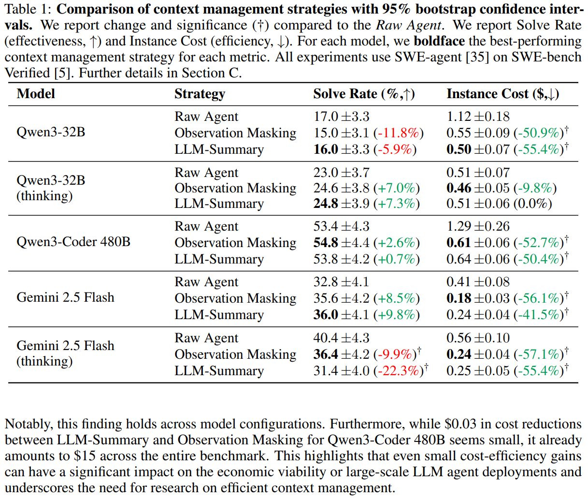

<li><i><b>The Complexity Trap: Simple Observation Masking Is as Efficient as LLM Summarization for Agent Context Management</b></i>, Lindenbauer et al.,  
  <b>Benchmark:</b> SWE-bench Verified, evaluated across five model configurations in SWE-agent, with an additional generalization probe on the OpenHands agent scaffold. 
  

    
    
  

</li>