<li><i><b>The Complexity Trap: Simple Observation Masking Is as Efficient as LLM Summarization for Agent Context Management</b></i>, Lindenbauer et al.,  
  <b>Benchmark:</b> SWE-bench Verified, evaluated across five model configurations in SWE-agent, with an additional generalization probe on the OpenHands agent scaffold. 
  

    
    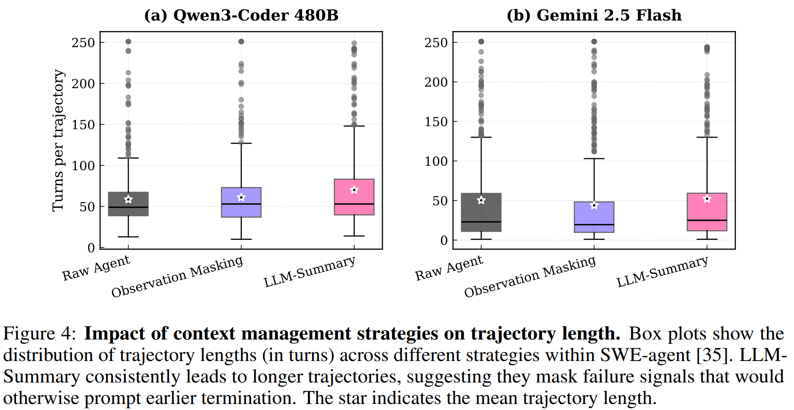
  

</li>

<li><i><b>A Real-World WebAgent with Planning, Long Context Understanding, and Program Synthesis</b></i> (HTML-T5), Gur et al.,  
  <b>Benchmark:</b> Real-world website evaluation on real estate, social media, and map websites using 20 custom instructions for task success rate; MiniWoB++ with 56 tasks; Mind2Web for generalization across 137 real websites and about 2,000 tasks. 
  

    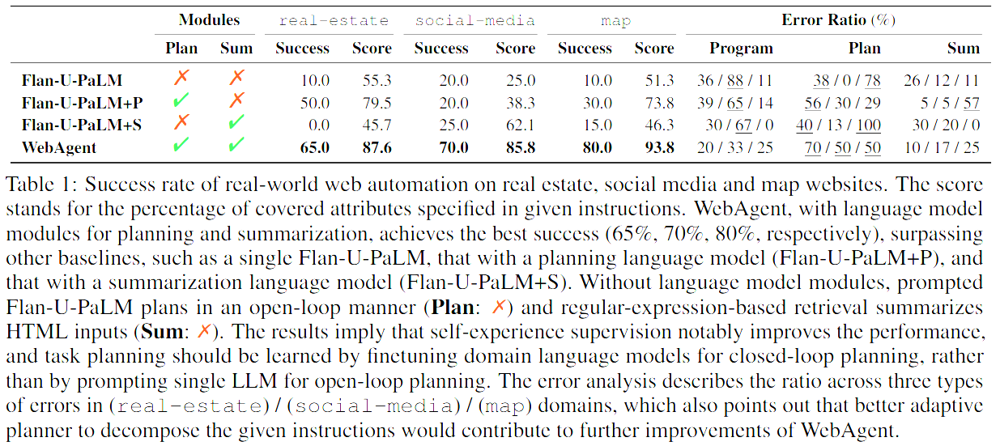
    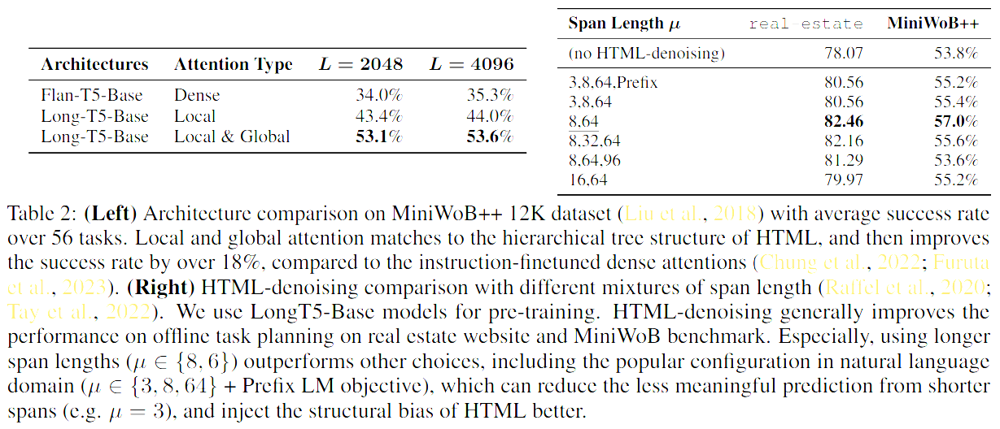
    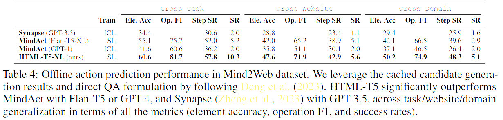
    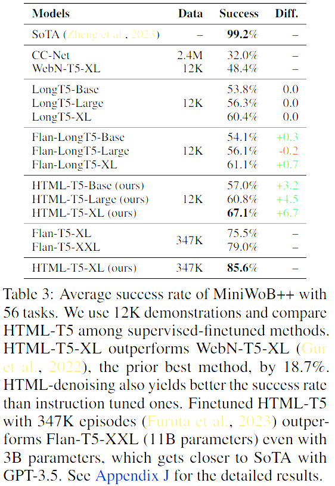
  

</li>

<li><i><b>Learning to Contextualize Web Pages for Enhanced Decision Making by LLM Agents</b></i> (LCoW), Lee et al.,  
  <b>Benchmark:</b> WebShop for simulated online shopping with 500 evaluation tasks and 5,500 training tasks, using 500 training tasks to train the context module and reporting success rate plus average reward on the 500 evaluation tasks; WorkArena for enterprise web tasks with 33 task types, trained on 495 tasks and evaluated on 165 tasks; WebArena with 812 tasks across 6 website categories, evaluated on 165 held-out tasks for success rate. 
  

    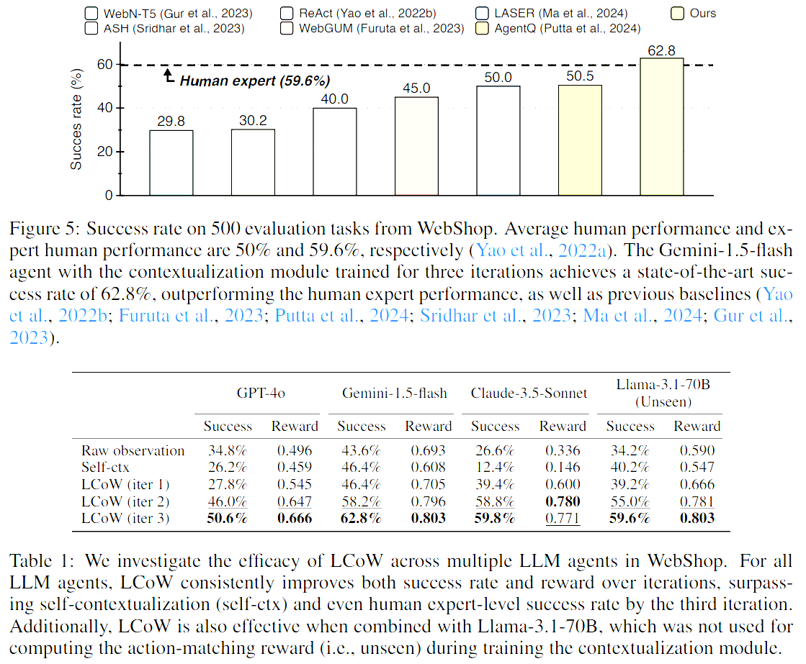
    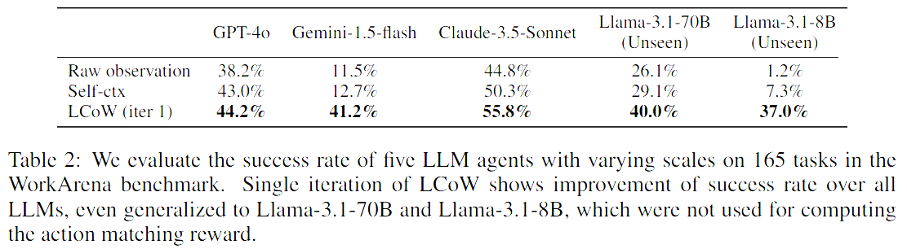
    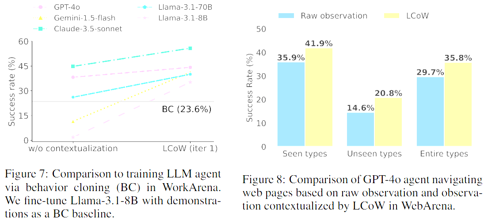
  

</li>

<li><i><b>SWE-Pruner: Self-Adaptive Context Pruning for Coding Agents</b></i>, Wang et al.,  
  <b>Benchmark:</b> SWE-Bench Verified with 500 real GitHub bug-fixing tasks; SWE-QA for question answering in specific code repositories including `streamlink`, `reflex`, and `conan`; Long Code Completion with 500 Python completion examples exceeding 5k tokens of context; Long Code QA with question answering over code contexts up to 1 million tokens. 
  

    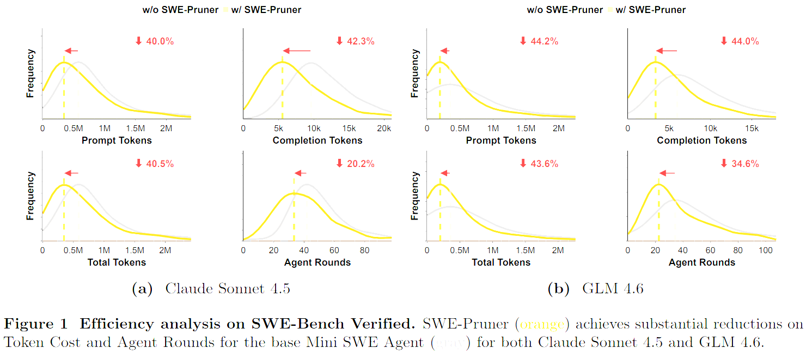
    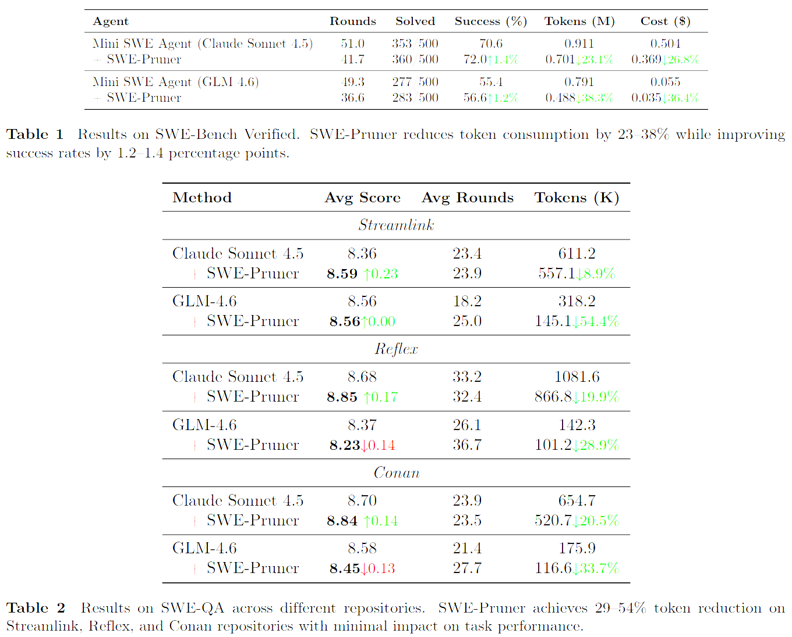
    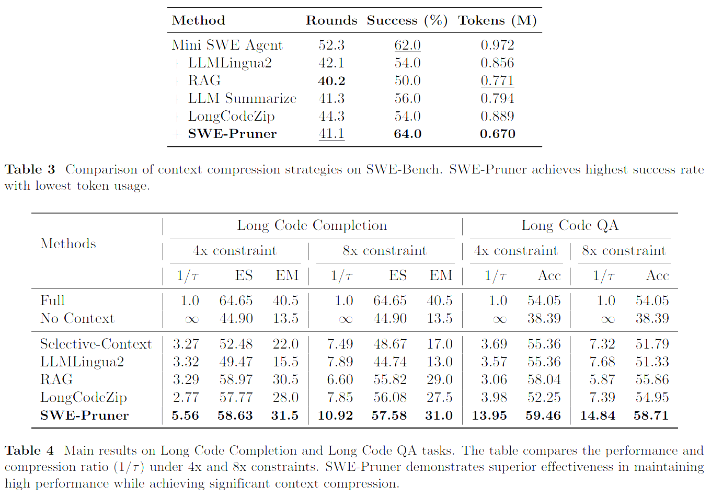
  

</li>

<li><i><b>PAL-UI: Planning with Active Look-back for Vision-Based GUI Agents</b></i>, Liu et al.,  
  <b>Benchmark:</b> AndroidControl-High for evaluating high-level planning on Android mobile apps; GUI-Odyssey for testing navigation generalization across different mobile apps; Multimodal-Mind2Web for zero-shot generalization to web browser interfaces without additional training. 
  

    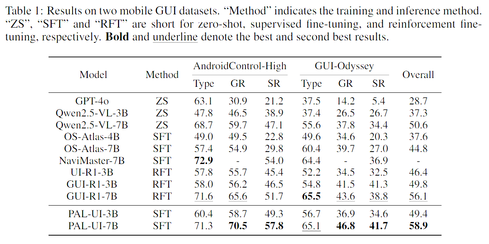
    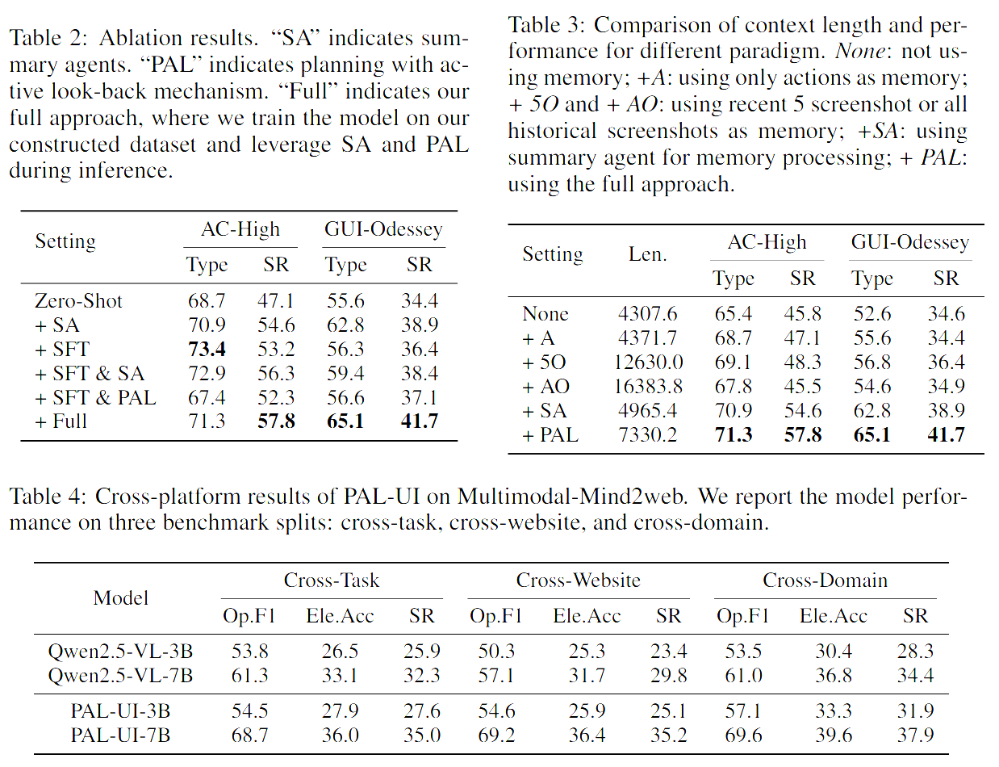
    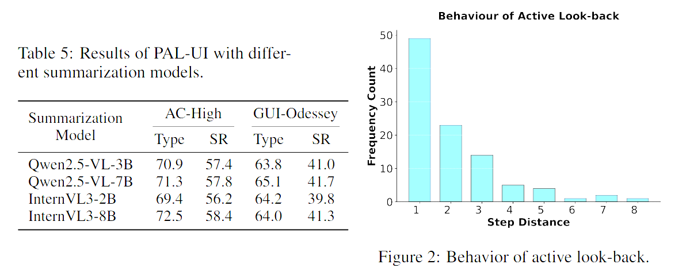
  

</li>
